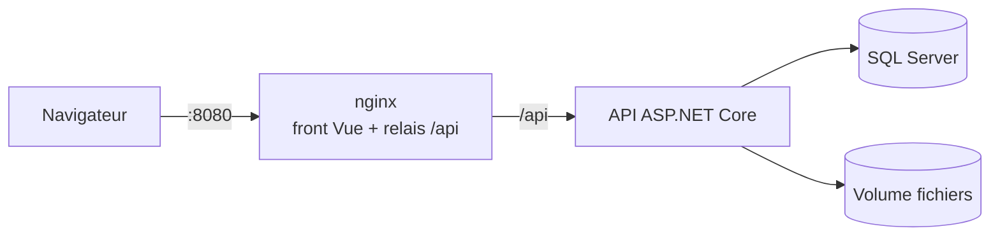

# SongVault

[](https://github.com/<owner>/<repo>/actions/workflows/ci.yml)

**SongVault** est une application web qui permet à un musicien ou à un groupe de gérer ses morceaux et leurs versions successives, de l'idée acoustique à l'arrangement studio. Chaque version regroupe maquettes audio (MP3, WAV, FLAC), tablatures (PDF, Guitar Pro), paroles et notes ; on l'écoute dans le navigateur et on la compare à une autre version.


## Démarrer en 5 minutes

Prérequis : [Docker Desktop](https://docs.docker.com/desktop/).

```bash
git clone https://github.com/<owner>/<repo>.git && cd <repo>
cp .env.example .env            # PowerShell : Copy-Item .env.example .env
docker compose --profile demo up -d --build
```

Ouvrir http://localhost:8080 et se connecter avec `demo@songvault.local` / le mot de passe `DEMO_PASSWORD` du fichier `.env`.

## Fonctionnalités

- Morceaux et versions numérotées par le serveur, sans doublon même en cas de créations simultanées
- Statuts (Idée → Finale), BPM, tonalité, notes et paroles
- Upload de fichiers vérifiés (extension, taille, signature binaire), stockés hors base
- Lecteur audio global avec déplacement (requêtes HTTP Range), comparaison A/B de deux versions
- Recherche et filtre synchronisés avec l'URL
- Comptes utilisateurs, chaque utilisateur ne voit que ses données

## Stack technique

| Couche | Technologies |
|---|---|
| Backend | .NET 10 (LTS), ASP.NET Core Web API, EF Core 10, SQL Server 2022, ASP.NET Core Identity |
| Frontend | Vue 3, TypeScript, Vite, Pinia, Vue Router |
| Tests | xUnit, Testcontainers, WebApplicationFactory, Vitest, Playwright |
| Industrialisation | Docker multi-stage, Docker Compose, nginx, GitHub Actions, Dependabot, CodeQL |

## Architecture

Monolithe modulaire en Clean Architecture légère. Détail et diagrammes : [docs/architecture.md](docs/architecture.md). Décisions : [docs/adr](docs/adr).



## Qualité

- 162 unitaires, 68 d'intégration contre un vrai SQL Server, 2 E2E exécutés à chaque PR
- Accessibilité Lighthouse ≥ 90 sur les pages principales
- Sécurité : cookie HttpOnly/SameSite, isolation par propriétaire (OWASP API1), rate limiting, en-têtes de sécurité

## Développer sans Docker

<!-- dotnet user-secrets, LocalDB, dotnet run, npm run dev : 6 à 8 lignes -->

## Documentation

- [Architecture](docs/architecture.md) · [Décisions (ADR)](docs/adr) · [Exploitation Docker](docs/runbook-docker.md)
- [Usage de l'IA](docs/ai-usage.md) · [Couverture des tests](docs/test-coverage.md) · [CHANGELOG](CHANGELOG.md)

## Licence

Code sous licence MIT. Les fichiers de `demo-assets/` sont la propriété de leur auteur : voir [demo-assets/LICENSE.md](demo-assets/LICENSE.md).