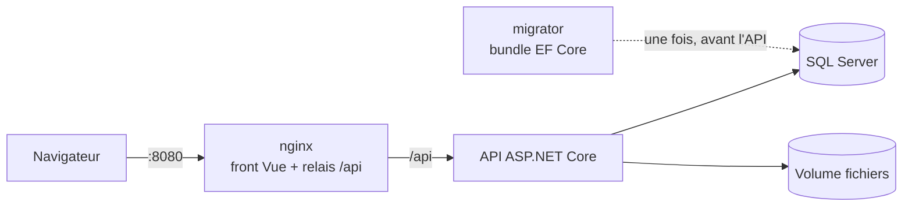
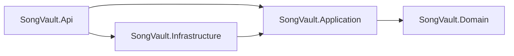

# 🎸 SongVault

[](https://github.com/<owner>/<repo>/actions/workflows/ci.yml)


**SongVault** est une application web qui permet à un musicien ou à un groupe de gérer ses
morceaux et leurs **versions successives**, de l'idée acoustique à l'arrangement studio.
Chaque version regroupe maquettes audio, tablatures, paroles et notes ; on l'écoute dans le
navigateur et on la compare à une autre version.

> Projet portfolio réalisé en 8 semaines pour démontrer une stack .NET et web actuelle :
> .NET 10, ASP.NET Core, EF Core, Vue 3 + TypeScript, Docker et GitHub Actions.


---

## Sommaire

- [Démarrer en 5 minutes](#démarrer-en-5-minutes)
- [Fonctionnalités](#fonctionnalités)
- [Captures d'écran](#captures-décran)
- [Stack technique](#stack-technique)
- [Architecture](#architecture)
- [Organisation du dépôt](#organisation-du-dépôt)
- [API](#api)
- [Qualité et tests](#qualité-et-tests)
- [Sécurité](#sécurité)
- [Développer sans Docker](#développer-sans-docker)
- [Intégration continue](#intégration-continue)
- [Exploitation](#exploitation)
- [Documentation](#documentation)
- [Limites connues et évolutions](#limites-connues-et-évolutions)
- [Licence](#licence)

---

## Démarrer en 5 minutes

**Prérequis :** [Docker Desktop](https://docs.docker.com/desktop/) (ou Docker Engine avec
Compose v2). Rien d'autre : ni SDK .NET, ni Node.js, ni SQL Server.

```bash
git clone https://github.com/<owner>/<repo>.git
cd <repo>
cp .env.example .env            # PowerShell : Copy-Item .env.example .env
# Éditez .env : MSSQL_SA_PASSWORD et DEMO_PASSWORD
docker compose --profile demo up -d --build
```

Le premier démarrage prend quelques minutes (téléchargement des images, compilation).
Ensuite :

1. Ouvrez **http://localhost:8080**.
2. Connectez-vous avec **`demo@songvault.local`** et le mot de passe `DEMO_PASSWORD` de
   votre fichier `.env`.
3. Ouvrez un morceau, écoutez la v2, puis comparez la v2 et la v3.

Le profil `demo` ajoute un compte et des morceaux d'exemple. Le chargement est idempotent :
le relancer ne duplique rien. Sans `--profile demo`, l'application démarre vide.

**Arrêter :**

```bash
docker compose down          # conserve les données
docker compose down -v       # supprime aussi la base et les fichiers
```

---

## Fonctionnalités

- **Morceaux et versions** : chaque version reçoit un numéro (v1, v2…) attribué par le
  serveur, sans doublon même en cas de créations simultanées.
- **Fiche de version** : statut (Idée → Maquette → Arrangement → Répétition → Studio →
  Finale), BPM, tonalité, notes et
  paroles.
- **Fichiers** : maquettes audio (MP3, WAV, FLAC), tablatures (PDF, Guitar Pro), images.
  Extension, taille (50 Mo max) et **signature binaire** vérifiées ; contenu stocké hors
  base.
- **Lecteur audio global** qui reste actif d'une page à l'autre, avec déplacement dans le
  morceau (requêtes HTTP `Range`) et raccourci clavier lecture/pause.
- **Comparaison A/B** de deux versions d'un même morceau, avec une URL partageable.
- **Recherche et filtres** synchronisés avec l'URL.
- **Comptes utilisateurs et groupes** : chaque morceau appartient à un groupe, un utilisateur peut être membre de plusieurs groupes et ne voit que les leurs. 
  Trois rôles par groupe : propriétaire (gère les membres), membre (crée et modifie), invité (lit et écoute).
- **Accessibilité** : navigation complète au clavier, lien d'évitement, focus géré à
  chaque changement de page, boîtes de confirmation accessibles.

---

## Captures d'écran

| Liste des morceaux | Détail d'une version |
|---|---|
|  |  |

| Pull request avec CI verte | Audit Lighthouse |
|---|---|
|  |  |

Une vidéo de démonstration de 3 minutes est disponible : <!-- lien vers la vidéo -->

---

## Stack technique

| Couche | Technologies |
|---|---|
| Backend | .NET 10 (LTS), ASP.NET Core Web API, EF Core 10, SQL Server 2022, ASP.NET Core Identity |
| Frontend | Vue 3 (Composition API), TypeScript, Vite, Pinia, Vue Router |
| Tests | xUnit, Testcontainers, WebApplicationFactory, Vitest, Vue Test Utils, Playwright |
| Conteneurs | Dockerfile multi-stage, Docker Compose, nginx (non privilégié) |
| CI/CD | GitHub Actions, Dependabot, protection de branche par ruleset |
| Documentation | OpenAPI (généré depuis le code), Scalar, Mermaid, ADR |

---

## Architecture

Monolithe modulaire en **architecture propre légère** : le domaine ne dépend d'aucun
paquet technique, et le compilateur garantit le sens des dépendances.





**Points clés :**

- **Une seule origine** : nginx sert le front et relaie `/api` vers l'API. Pas de CORS, et
  un cookie d'authentification `SameSite=Strict` suffit.
- **Fichiers hors base** : SQL Server garde les métadonnées, le contenu est sur un volume
  derrière `IFileStorageService`.
- **Concurrence optimiste** : `rowversion`, index unique et nouvelles tentatives pour la
  numérotation des versions.
- **Migrations** appliquées par un conteneur ponctuel (`migrator`) avant le démarrage de
  l'API, jamais par l'API elle-même.

Détail et diagrammes : [docs/architecture.md](docs/architecture.md).
Décisions argumentées : [docs/adr](docs/adr/README.md).

| ADR | Décision |
|---|---|
| [0001](docs/adr/0001-monolithe-modulaire.md) | Monolithe modulaire plutôt que microservices |
| [0002](docs/adr/0002-fichiers-hors-base.md) | Fichiers stockés hors de la base |
| [0003](docs/adr/0003-numerotation-des-versions.md) | Numérotation des versions et concurrence optimiste |
| [0004](docs/adr/0004-cookies-plutot-que-jwt.md) | Cookie plutôt que JWT |
| [0005](docs/adr/0005-bundle-de-migrations.md) | Bundle de migrations dans un conteneur ponctuel |
| [0006](docs/adr/0006-pas-de-mediatr.md) | Ni MediatR ni repository générique |

---

## Organisation du dépôt

```text
.
├── src/
│   ├── SongVault.Domain/           # entités, règles métier, aucune dépendance technique
│   ├── SongVault.Application/      # cas d'usage (handlers), abstractions
│   ├── SongVault.Infrastructure/   # EF Core, SQL Server, stockage des fichiers
│   └── SongVault.Api/              # contrôleurs, authentification, Program.cs, Dockerfile
├── tests/
│   ├── SongVault.Domain.Tests/
│   ├── SongVault.Application.Tests/
│   └── SongVault.Api.Tests/        # tests d'intégration (Testcontainers + SQL Server)
├── web/songvault-web/              # front Vue 3 + TypeScript, Dockerfile nginx
│   ├── src/features/               # songs, versions, files, player, auth
│   └── e2e/                        # tests Playwright
├── demo-assets/                    # fichiers du jeu de démonstration
├── docs/                           # architecture, ADR, exploitation, images
├── scripts/                        # sauvegarde, couverture de tests
├── compose.yaml                    # db, migrator, api, web (+ seed avec --profile demo)
├── compose.override.yaml           # ports supplémentaires en développement
└── .github/                        # workflow CI, Dependabot
```

---

## API

Le contrat OpenAPI est généré depuis le code et ses commentaires XML. En développement :
**http://localhost:5080/scalar** (interface) ou **/openapi/v1.json** (document).

| Méthode | Route | Description |
|---|---|---|
| `POST` | `/api/auth/register` | Créer un compte |
| `POST` | `/api/auth/login?useCookies=true` | Se connecter (cookie) |
| `POST` | `/api/auth/logout` | Se déconnecter |
| `GET` | `/api/auth/me` | Utilisateur connecté |
| `GET` `POST` | `/api/bands` | Mes groupes (avec mon rôle), créer un groupe |
| `GET` `PUT` | `/api/bands/{bandId}` | Lire, renommer un groupe (renommer : Owner) |
| `GET` | `/api/bands/{bandId}/members` | Membres du groupe et leurs rôles |
| `PUT` | `/api/bands/{bandId}/members/{userId}/role` | Changer le rôle d'un membre (Owner) |
| `DELETE` | `/api/bands/{bandId}/members/{userId}` | Retirer un membre (Owner) |
| `DELETE` | `/api/bands/{bandId}/members/me` | Quitter le groupe |
| `GET` | `/api/bands/{bandId}/songs` | Liste paginée, recherche |
| `POST` | `/api/bands/{bandId}/songs` | Créer un morceau |
| `GET` `PUT` `DELETE` | `/api/bands/{bandId}/songs/{id}` | Lire, modifier, supprimer un morceau |
| `GET` `POST` | `/api/bands/{bandId}/songs/{songId}/versions` | Lister, créer des versions |
| `GET` `PUT` | `…/versions/{versionId}` | Lire, modifier une version |
| `POST` | `…/versions/{versionId}/files` | Envoyer un fichier |
| `GET` | `…/files/{fileId}/content` | Lire ou télécharger un fichier (`Range` accepté) |
| `DELETE` | `…/files/{fileId}` | Supprimer un fichier |
| `GET` | `/api/files/policy` | Extensions acceptées et taille maximale |

Sous /api/bands/{bandId}, les lectures sont ouvertes à tout membre du groupe et les écritures demandent au moins le rôle Member, 
sauf mention contraire ([ADR 0008](docs/adr/0008-roles-dans-le-groupe.md)).
Les erreurs suivent la RFC 9457 (application/problem+json) : 400 validation, 401 non
connecté, 403 rôle insuffisant dans le groupe, 404 introuvable (ou groupe dont on n'est pas
membre), 409 conflit de concurrence ou dernier propriétaire du groupe, 413 fichier trop
volumineux, 422 règle métier, 429 trop de requêtes.
---

## Qualité et tests

| Niveau | Outils | Nombre | Ce qui est vérifié |
|---|---|---|---|
| Domaine | xUnit | … | règles métier, sans base ni conteneur |
| Application | xUnit, faux repositories | … | cas d'usage |
| Intégration API | xUnit, WebApplicationFactory, **Testcontainers SQL Server** | … | HTTP de bout en bout contre un vrai SQL Server : codes d'erreur, concurrence, isolation par utilisateur, sécurité des fichiers |
| Front | Vitest, Vue Test Utils | … | stores Pinia, composables, garde de navigation |
| Bout en bout | Playwright | 2 | inscription → morceau → version → fichier → lecture → déconnexion |

<!-- Remplacez les … par les chiffres de `dotnet test` et `npm run test:unit -- --run`. -->

- Couverture du code : voir [docs/test-coverage.md](docs/test-coverage.md)
  (`scripts/coverage.ps1` génère le rapport).
- Accessibilité Lighthouse : **…/100** sur la liste, le détail d'un morceau et le détail
  d'une version.
- Requêtes SQL maîtrisées : 2 pour la liste, 3 pour le détail d'un morceau, 4 pour le
  détail d'une version, quel que soit le volume de données.

**Lancer les tests :**

```bash
dotnet test                                   # backend (Docker requis pour Testcontainers)
cd web/songvault-web
npm ci
npm run test:unit -- --run                    # front
npx playwright test                           # E2E (application lancée sur :8080)
```

---

## Sécurité

- **Authentification** par ASP.NET Core Identity et cookie `HttpOnly`, `SameSite=Strict` :
  aucun jeton accessible à JavaScript.
- **Isolation des données** : chaque requête est limitée au groupe de l'URL ; un non-membre
  reçoit 404 (OWASP API1 — *Broken Object Level Authorization*), un membre dont le rôle ne
  suffit pas reçoit 403 (OWASP API5 — *Broken Function Level Authorization*).
- **Fichiers** : liste blanche d'extensions, taille maximale, contrôle de la **signature
  binaire** (un `.exe` renommé en `.mp3` est refusé), nom de stockage généré par le serveur.
- **Limitation de débit** sur l'authentification et l'envoi de fichiers (429).
- **En-têtes de sécurité** : `Content-Security-Policy`, `X-Content-Type-Options`,
  `Referrer-Policy: no-referrer`, `X-Frame-Options: DENY`.
- **Secrets** : aucun dans le dépôt. `.env` est ignoré par Git, `.env.example` documente
  les variables ; en développement, `dotnet user-secrets`.
- **Dépendances** : mises à jour proposées automatiquement par Dependabot, avec la CI comme
  garde-fou.

---

## Développer sans Docker

**Prérequis :** SDK .NET 10, Node.js (version indiquée dans `web/songvault-web/.nvmrc`), et un SQL Server (LocalDB, ou le
conteneur `db` de Compose publié sur `localhost,1433`).

```powershell
# 1. Configuration locale de l'API (secrets hors du dépôt)
dotnet user-secrets set "ConnectionStrings:SongVault" "Server=localhost,1433;Database=SongVault;User Id=sa;Password=<mot de passe>;TrustServerCertificate=True" --project src/SongVault.Api
dotnet user-secrets set "FileStorage:RootPath" "C:\SongVault\files" --project src/SongVault.Api

# 2. Base de données
dotnet tool restore
dotnet ef database update --project src/SongVault.Infrastructure --startup-project src/SongVault.Api

# 3. API (http://localhost:5080, Scalar sur /scalar)
dotnet run --project src/SongVault.Api --launch-profile http

# 4. Front, dans un second terminal (http://localhost:5173, /api relayé vers l'API)
cd web/songvault-web
npm ci
npm run dev
```

---

## Intégration continue

Chaque pull request vers `main` déclenche [`.github/workflows/ci.yml`](.github/workflows/ci.yml) :

| Job | Étapes |
|---|---|
| `backend` | restauration, build en Release (avertissements = erreurs), tests unitaires et d'intégration |
| `frontend` | `npm ci`, vérification des types, lint, tests Vitest, build |
| `docker` | construction des images, `docker compose up`, test de fumée : inscription → connexion → appel authentifié |

La branche `main` est protégée : fusion uniquement par pull request, avec les trois
vérifications au vert. Dependabot propose chaque semaine les mises à jour NuGet, npm,
images Docker et actions GitHub, regroupées pour limiter le bruit.

---

## Exploitation

- **Configuration** : variables d'environnement définies dans `.env` (voir `.env.example`).
- **Santé** : `GET /health/live` (processus vivant) et `GET /health/ready` (base joignable)
  sur l'API, utilisés par les healthchecks Compose.
- **Journaux** : JSON structurés hors développement (`docker compose logs api`).
- **Sauvegarde** de la base et du volume de fichiers : `scripts/` et
  [docs/runbook-docker.md](docs/runbook-docker.md).

---

## Documentation

- [Architecture](docs/architecture.md) — composants, flux, modèle de données
- [Décisions d'architecture (ADR)](docs/adr/README.md)
- [Exploitation Docker](docs/runbook-docker.md) — démarrage, sauvegarde, restauration, dépannage
- [Couverture des tests](docs/test-coverage.md)
- [Usage de l'IA](docs/ai-usage.md) — comment l'IA a été utilisée et ce qui a été vérifié
- [CHANGELOG](CHANGELOG.md)

---

## Limites connues et évolutions

Choix assumés pour la v1 :

- Un seul serveur : le stockage des fichiers est local. Une implémentation Azure Blob
  Storage est possible derrière la même interface.
- Pas encore d'invitations : un membre ne peut être ajouté à un groupe qu'en base.
- Pas de traitement audio côté serveur (forme d'onde, transcodage).

Pistes suivies dans les [issues](https://github.com/<owner>/<repo>/issues).

---

## Licence

Code sous licence [MIT](LICENSE).
Les fichiers de `demo-assets/` ont leurs propres conditions :
voir [demo-assets/LICENSE.md](demo-assets/LICENSE.md).

---

**Auteur :** <Votre nom> — développeur .NET ·
[LinkedIn](https://www.linkedin.com/in/<profil>) · [GitHub](https://github.com/<owner>)
