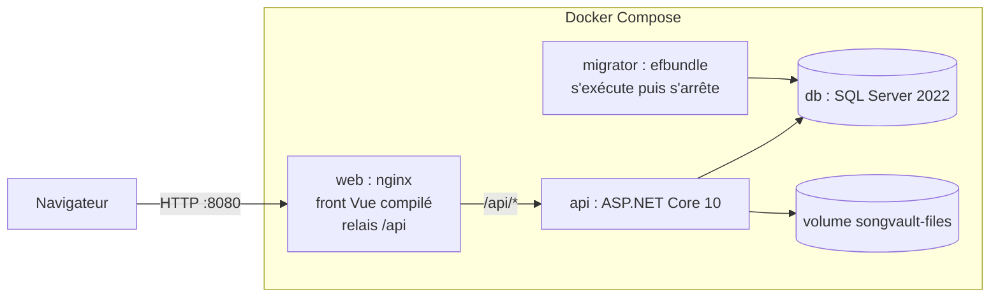
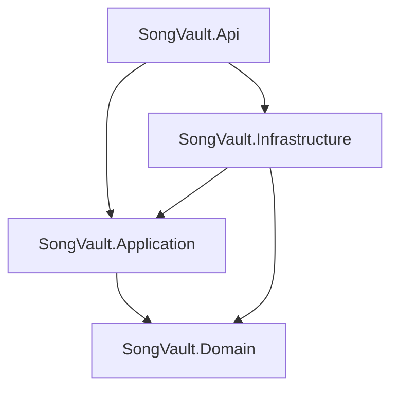
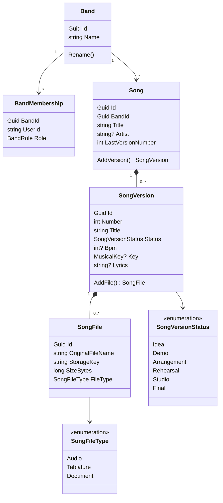
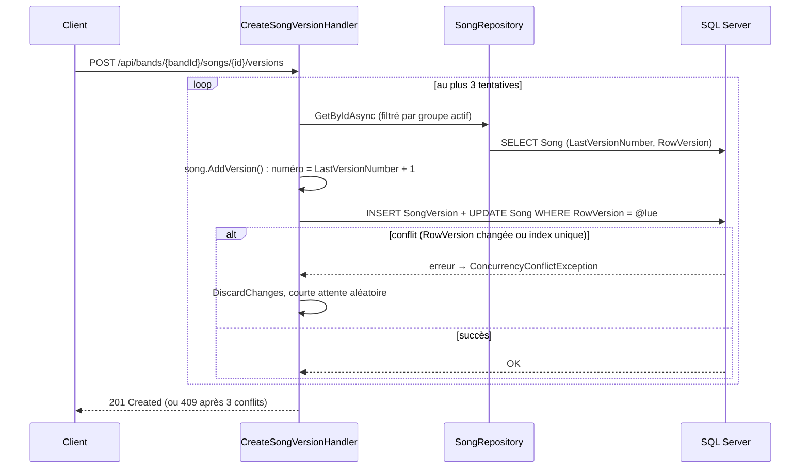
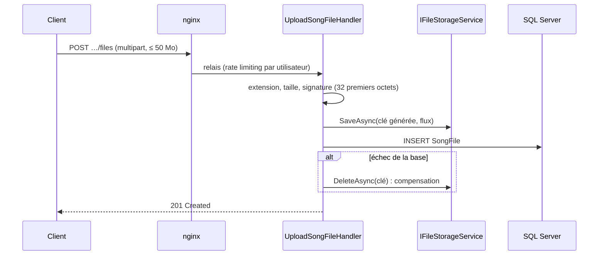

# Architecture de SongVault

## Vue d'ensemble

## Dépendances entre projets

Domain ne dépend de rien ; les abstractions (`ISongRepository`, `IBandRepository`, `IFileStorageService`, `ICurrentUser`, `IBandContext`) sont dans Application, leurs implémentations dans Infrastructure et Api.

## Modèle métier

Extensions envisagées hors MVP : `Band` et `Member` (groupes), `Comment` (commentaires horodatés sur l'audio), `Tag`, `Setlist`.

## Création d'une version (numérotation concurrente)

## Upload d'un fichier

